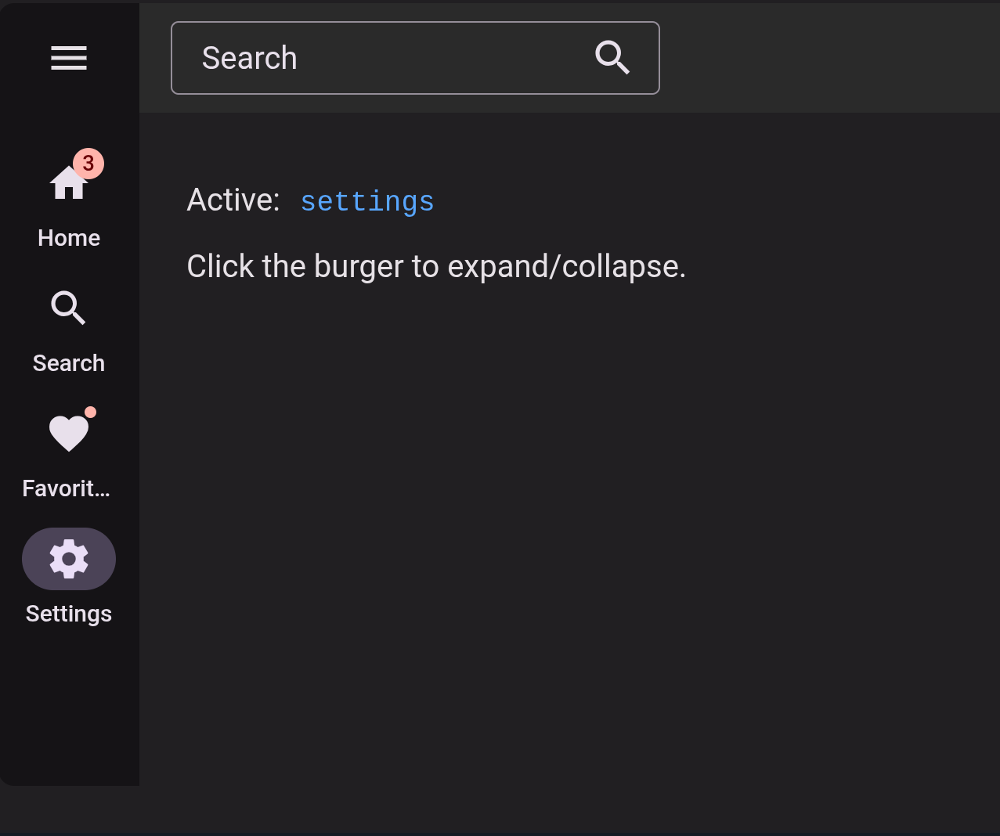
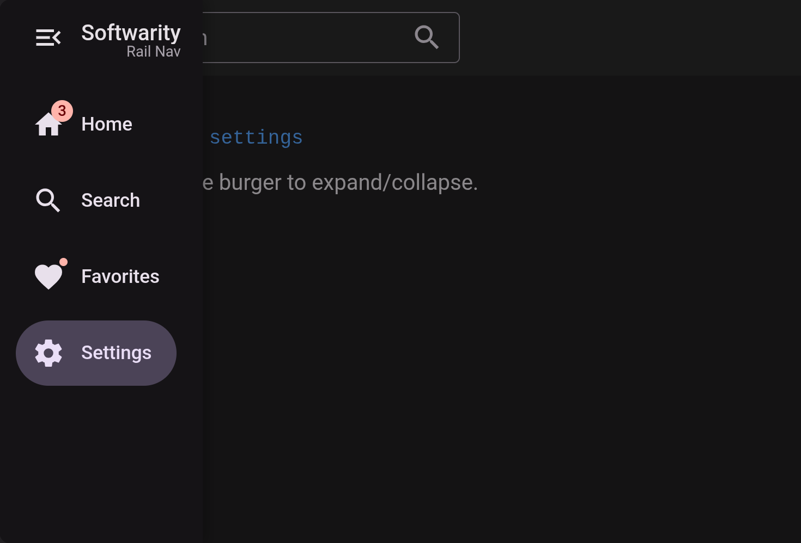
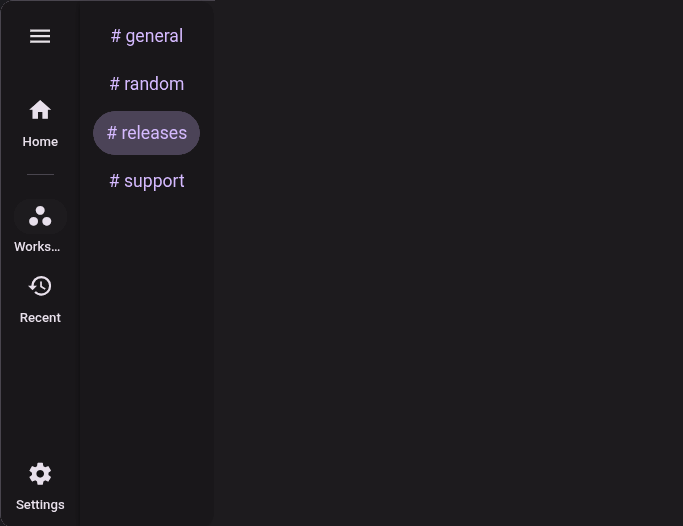

<p align="center">
  <a href="https://www.softwarity.io/">
    
  </a>
</p>

# @softwarity/rail-nav

<p align="center">
  <a href="https://www.npmjs.com/package/@softwarity/rail-nav">
    
  </a>
  <a href="https://github.com/softwarity/rail-nav/blob/main/LICENSE">
    
  </a>
</p>

Material Design 3 Navigation Rail component for Angular. Extends Angular Material `mat-sidenav` to provide a collapsible rail navigation pattern.

**[Live Demo](https://softwarity.github.io/rail-nav/)**

<p align="center">
  <a href="https://softwarity.github.io/rail-nav/">
    
  </a>
  <a href="https://softwarity.github.io/rail-nav/">
    
  </a>
  <a href="https://softwarity.github.io/rail-nav/">
    
  </a>
</p>

## Features

- **Material Design 3** - Implements the Navigation Rail pattern from MD3
- **Extends Material** - Built on top of `MatSidenav` for reliability
- **Navigation Items** - `rail-nav-item` component with MD3 pill animation, badges, and router support
- **Contextual Drawer** - `[for]` on an item opens a side drawer from an `<ng-template>`, with hover-intent, content cross-fade, outside-tap dismiss and mobile support
- **Separator & Spacer** - `rail-nav-separator` to group items, `rail-nav-spacer` to anchor items at the bottom
- **Expand/Collapse** - Smooth transition between rail and drawer with adaptive width
- **Backdrop** - Optional backdrop overlay when expanded
- **Position** - Support for left (start) or right (end) positioning
- **Dark Mode** - Automatically adapts to light/dark color scheme
- **SCSS Theming** - Customizable via SCSS mixin following Angular Material pattern

## Installation

```bash
npm install @softwarity/rail-nav
```

### Peer Dependencies

| Package | Version |
|---------|---------|
| @angular/common | >= 21.0.0 |
| @angular/core | >= 21.0.0 |
| @angular/cdk | >= 21.0.0 |
| @angular/material | >= 21.0.0 |

## Usage

Import the components in your Angular component:

```typescript
import {
  RailnavComponent,
  RailnavContainerComponent,
  RailnavContentComponent,
  RailnavItemComponent,
  RailnavSeparatorComponent, // Optional: separator between item groups
  RailnavSpacerComponent,    // Optional: push following items to the bottom
  RailnavBrandingDirective   // Optional: for custom branding
} from '@softwarity/rail-nav';

@Component({
  imports: [
    RailnavComponent,
    RailnavContainerComponent,
    RailnavContentComponent,
    RailnavItemComponent,
    RailnavSeparatorComponent,
    RailnavSpacerComponent,
    RailnavBrandingDirective
  ],
  template: `
    <rail-nav-container>
      <rail-nav title="My App" subtitle="v1.0">
        <rail-nav-item label="Home" routerLink="/home">
          <mat-icon>home</mat-icon>
        </rail-nav-item>
        <rail-nav-item label="Settings" routerLink="/settings">
          <mat-icon>settings</mat-icon>
        </rail-nav-item>
      </rail-nav>
      <rail-nav-content>
        <!-- Page content -->
      </rail-nav-content>
    </rail-nav-container>
  `
})
export class AppComponent {}
```

## API

### RailnavComponent

The main navigation rail component. Extends `MatSidenav`.

| Input | Type | Default | Description |
|-------|------|---------|-------------|
| `position` | `'start' \| 'end'` | `'start'` | Position of the rail (left or right) |
| `title` | `string` | - | Title displayed next to burger when expanded |
| `subtitle` | `string` | - | Subtitle displayed below title when expanded |
| `hideDefaultHeader` | `boolean` | `false` | Hide the default header to provide custom content |
| `autoCollapse` | `boolean` | `true` | Auto-collapse the rail when an item is clicked |

| Property/Method | Type | Description |
|-----------------|------|-------------|
| `expanded` | `Signal<boolean>` | Read the current expanded state |
| `toggleExpanded()` | `void` | Toggle between collapsed and expanded |
| `expand()` | `void` | Expand the rail |
| `collapse()` | `void` | Collapse the rail |

### RailnavContainerComponent

Container component. Extends `MatSidenavContainer`.

| Input | Type | Default | Description |
|-------|------|---------|-------------|
| `showBackdrop` | `boolean` | `true` | Show backdrop overlay when expanded |

### RailnavContentComponent

Content area component. Extends `MatSidenavContent`.

**Note:** When placed inside a `rail-nav-container` alongside a `rail-nav`, the component automatically detects the rail position and applies the correct margin using the `--rail-nav-collapsed-width` CSS variable.

### RailnavItemComponent

Navigation item with MD3 pill animation.

| Input | Type | Default | Description |
|-------|------|---------|-------------|
| `routerLink` | `string \| any[]` | - | Router link for navigation |
| `label` | `string` | - | Label text (below icon when collapsed, beside when expanded) |
| `badge` | `string \| number \| boolean` | - | Badge value. Use `true` for a small dot badge |
| `active` | `boolean` | `false` | Whether this item is active (for non-router usage) |
| `for` | `TemplateRef \| null` | `null` | Template projected as a contextual drawer when the item is hovered or clicked. Aliased to `for` for `mat-datepicker-toggle`-style ergonomics. See [Contextual drawer](#contextual-drawer). |

| Output | Type | Description |
|--------|------|-------------|
| `itemClick` | `void` | Emitted when clicked (automatically collapses rail) |

### RailnavSeparatorComponent

Visual separator between groups of `<rail-nav-item>`. Hairline 1px rule, vertically centered in a fixed-height host so the spacing stays consistent across collapsed / expanded modes.

```html
<rail-nav>
  <rail-nav-item label="Home">...</rail-nav-item>
  <rail-nav-separator />
  <rail-nav-item label="Trash">...</rail-nav-item>
</rail-nav>
```

Color overridable via `--rail-nav-separator-color`.

### RailnavSpacerComponent

Flexible spacer (`flex: 1 1 auto`). Place between two groups of items to push everything after it to the bottom of the rail — the classic pattern for primary nav on top and Settings / Profile anchored at the bottom.

```html
<rail-nav>
  <rail-nav-item label="Home">...</rail-nav-item>
  <rail-nav-item label="Inbox">...</rail-nav-item>
  <rail-nav-spacer />
  <rail-nav-item label="Settings">...</rail-nav-item>
</rail-nav>
```

## Contextual drawer

Any rail item can declare a contextual side drawer with `[for]="someTemplate"`. The library renders the template in a CDK overlay positioned right next to the rail, handles hover-intent (200ms), close debounce (300ms for cursor transit), outside-tap dismiss, auto-close when the rail is expanded, and re-targets the same overlay when the cursor moves between trigger items.

```ts
import {
  RailnavComponent,
  RailnavContainerComponent,
  RailnavContentComponent,
  RailnavItemComponent,
} from '@softwarity/rail-nav';

@Component({
  imports: [
    RailnavComponent,
    RailnavContainerComponent,
    RailnavContentComponent,
    RailnavItemComponent,
  ],
  template: `
    <rail-nav-container>
      <rail-nav>
        <rail-nav-item label="Workspaces" [for]="wsTpl">
          <mat-icon>workspaces</mat-icon>
        </rail-nav-item>
      </rail-nav>
      <rail-nav-content>...</rail-nav-content>
    </rail-nav-container>

    <ng-template #wsTpl>
      <a routerLink="/ws/1">Workspace 1</a>
      <a routerLink="/ws/2">Workspace 2</a>
    </ng-template>
  `,
})
export class AppComponent {}
```

The drawer panel applies its own chrome (background, shadow, rounded right corner) and a default nav-list layout (flex column, padding, gap, fixed width) — your template only needs the children. Both desktop hover and mobile tap open the drawer; the lib swallows the synthetic mouse events touch devices fire after a tap so the drawer doesn't close instantly.

### Drawer CSS custom properties

Override per rail (or globally) — all read with sane Material defaults as fallback.

| Variable | Default | Description |
|----------|---------|-------------|
| `--rail-nav-drawer-width` | `240px` | Fixed drawer width |
| `--rail-nav-drawer-padding` | `12px` | Inner padding |
| `--rail-nav-drawer-gap` | `4px` | Vertical gap between children |
| `--rail-nav-drawer-surface` | `var(--mat-sys-surface)` | Background color |
| `--rail-nav-drawer-on-surface` | `var(--mat-sys-on-surface)` | Text color |
| `--rail-nav-drawer-shadow` | `var(--mat-sys-level2)` | Elevation |
| `--rail-nav-drawer-radius` | `0 12px 12px 0` | Outer border-radius |

## SCSS Theming

Use the SCSS mixin to customize colors following the Angular Material pattern:

```scss
@use '@softwarity/rail-nav/rail-nav-theme' as rail-nav;

:root {
  @include rail-nav.overrides((
    backdrop-color: rgba(0, 0, 0, 0.5),
    primary: #6200ea,
    surface-color: #f5f5f5,
  ));
}
```

### Available Tokens

| Token | Default | Description |
|-------|---------|-------------|
| `collapsed-width` | `72px` | Width of the rail when collapsed |
| `expanded-width` | `fit-content` | Width of the rail when expanded |
| `header-height` | `56px` | Height of the header area |
| `backdrop-color` | - | Background color for the backdrop overlay |
| `surface-color` | - | Background color for the rail |
| `surface-container-high` | - | Background color for hover states |
| `on-surface` | - | Text color for primary content |
| `on-surface-variant` | - | Text color for secondary content |
| `secondary-container` | - | Background color for active items |
| `on-secondary-container` | - | Text color for active items |
| `primary` | - | Focus ring color |
| `error` | - | Badge background color |
| `on-error` | - | Badge text color |

## CSS Custom Properties

You can also use CSS custom properties directly.

### Size Properties

```css
:root {
  --rail-nav-collapsed-width: 72px;
  --rail-nav-expanded-width: fit-content;
  --rail-nav-header-height: 56px;
}
```

### Color Properties

Color properties support the CSS `light-dark()` function for automatic light/dark theme adaptation:

```css
:root {
  /* Static colors (single theme) */
  --rail-nav-surface-color: #ffffff;
  --rail-nav-primary: #6750a4;

  /* Or use light-dark() for automatic theme adaptation */
  --rail-nav-surface-color: light-dark(#ffffff, #1e1e1e);
  --rail-nav-primary: light-dark(#6750a4, #d0bcff);
}
```

The component uses Material Design 3 system tokens (`--mat-sys-*`) as fallbacks.

## Light/Dark Theme Support

Use the CSS `light-dark()` function to define colors that automatically adapt to the user's color scheme. The first value is for light mode, the second for dark mode.

### With SCSS mixin

```scss
@use '@softwarity/rail-nav/rail-nav-theme' as rail-nav;

:root {
  @include rail-nav.overrides((
    backdrop-color: light-dark(rgba(0, 0, 0, 0.4), rgba(0, 0, 0, 0.6)),
    surface-color: light-dark(#ffffff, #1e1e1e),
    on-surface: light-dark(#1c1b1f, #e6e1e5),
    primary: light-dark(#6750a4, #d0bcff),
  ));
}
```

### With CSS custom properties

```css
:root {
  --rail-nav-backdrop-color: light-dark(rgba(0, 0, 0, 0.4), rgba(0, 0, 0, 0.6));
  --rail-nav-surface-color: light-dark(#ffffff, #1e1e1e);
  --rail-nav-on-surface: light-dark(#1c1b1f, #e6e1e5);
  --rail-nav-on-surface-variant: light-dark(#49454f, #cac4d0);
  --rail-nav-secondary-container: light-dark(#e8def8, #4a4458);
  --rail-nav-on-secondary-container: light-dark(#1d192b, #e8def8);
  --rail-nav-primary: light-dark(#6750a4, #d0bcff);
  --rail-nav-error: light-dark(#b3261e, #f2b8b5);
  --rail-nav-on-error: light-dark(#ffffff, #601410);
}
```

### Setting up color-scheme

For `light-dark()` to work, set the `color-scheme` property on your document:

```scss
html {
  color-scheme: light;
  &.dark-mode { color-scheme: dark; }
}

/* Or use system preference */
html {
  color-scheme: light dark;
}
```

## Example

```typescript
@Component({
  imports: [
    RailnavComponent,
    RailnavContainerComponent,
    RailnavContentComponent,
    RailnavItemComponent,
    MatIconModule
  ],
  template: `
    <rail-nav-container [showBackdrop]="true">
      <rail-nav title="My App" subtitle="v1.0">
        <rail-nav-item label="Home" [badge]="3" routerLink="/home">
          <mat-icon>home</mat-icon>
        </rail-nav-item>
        <rail-nav-item label="Favorites" [badge]="true" routerLink="/favorites">
          <mat-icon>favorite</mat-icon>
        </rail-nav-item>
        <rail-nav-item label="Settings" routerLink="/settings">
          <mat-icon>settings</mat-icon>
        </rail-nav-item>
      </rail-nav>
      <rail-nav-content>
        <main>Your content here</main>
      </rail-nav-content>
    </rail-nav-container>
  `
})
export class MyComponent {}
```

## License

Apache-2.0
